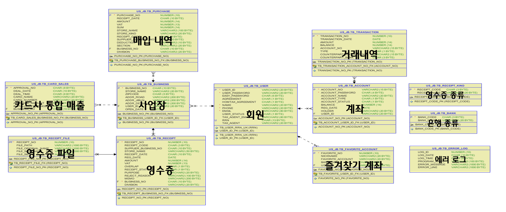
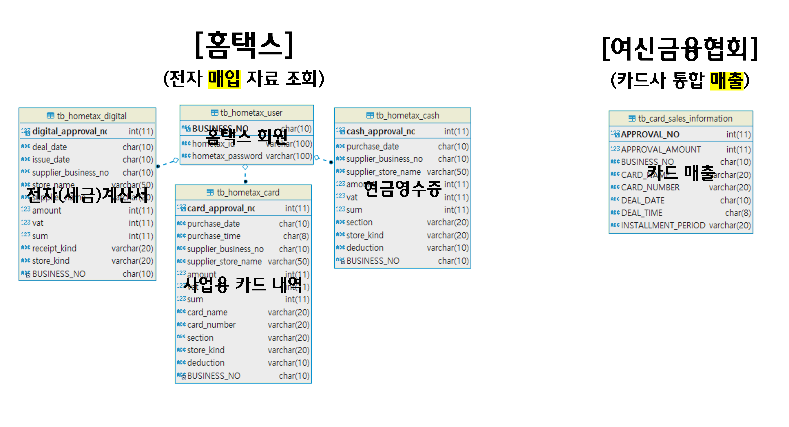
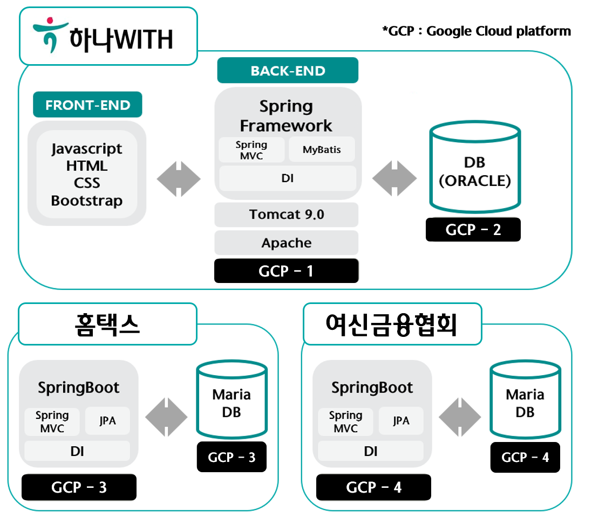
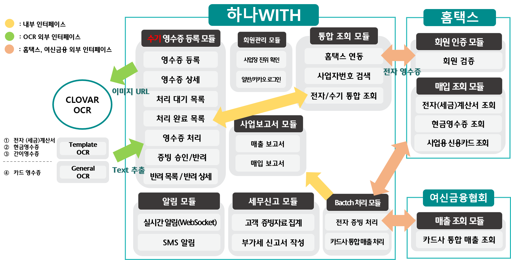

# 하나WITH

[프로젝트 홈페이지 - https://github.com/koposoftware/2021_6_jbpark](https://github.com/koposoftware/2021_6_jbpark)

# 1. 프로젝트 개요

하나WITH는 소상공인의 성공적인 사업장 운영을 위한 경영·세무 신고 지원 플랫폼 입니다.

국내 경제활동인구의 25%이상을 차지하는 자영업자, 전국 사업체 중 85%에 이르는 소상공인의 비중을 고려해 보았을 때, 국내 경제 규모에서 소상공인이 상당한 비중과 중요성을 차지한다는 것을 알 수 있습니다. 이런 배경에 비추어 보면, 은행은 소상공인 전용 서비스를 출시하여 소상공인 고객 점유율을 높이기 위해 노력해야 한다는 결론을 얻을 수 있습니다.

이미 농협은행, 국민은행, 기업은행 등 타행사는 소상공인이 국내 경제에서 차지하는 중요성을 인지하고 소상공인 전용 서비스를 출시했습니다. 하나은행도 하나WITH를 통해 소상공인 고객 점유율을 강화한다면, 금융 상품 연계를 통한 비즈니스 기회를 창출할 수 있습니다.

하나WITH는 소상공인, 세무사 각 주체가 WIN-WIN할 수 있는 서비스입니다. 하나WITH 소상공인이 세금신고에 필요한 매입/매출 증빙 자료를 통합 관리할 수 있습니다. 또한 자신의 사업장의 사업 현황을 편리하게 확인할 수 있는 시각화된 사업보고서를 제공합니다. 세무사는 자신이 담당하고 있는 고객 목록을 확인할 수 있고, 고객의 전자/수기 증빙 자료를 조회/수집할 수 있습니다. 집계된 내역을 바탕으로 부가세 신고서 자동 생성 기능을 제공합니다.

# 2. 프로젝트 제안서
 
## [**하나WITH 제안서**](/하나WITH_제안서.pptx) 
 

# 3. 프로젝트 결과
    
## [**하나WITH 최종 발표자료**](/하나WITH_최종발표자료.pptx) 

## 시연 동영상 
   
   <iframe id="ytplayer" type="text/html" width="640" height="360" src="https://www.youtube.com/embed/n-vYRwkgDJQ" frameborder="0"></iframe>

### **개발기간**
-2021. 09. 06 ~ 2021. 10. 05 

### **담당업무**
-아이디어 기획/설계 , DB모델링, Front-End, Back-End, Deploy 

### **개발환경** 
-Language : JAVA, JavaScript 
-Database : Oracle 18c, MariaDB 
-Framewo가 : Spring, MyBatis, SpringBoot,　JPA 
-Server :　Apache ,Tomcat9 
-Cloud : GCP (Google Cloud Platform)
-VCS :　GitHub 
-Library : JQuery, JSTL 
-Etc :　HeidiSQL, MobaXterm, Putty 

### **사용기술**
-Spring MVC 기반 웹 개발 
-OCR을 활용한 이미지 텍스트 추출(Template OCR, General　OCR) 
-WebSocket을 활용한 영수증 승인/반려 실시간 알림 
-JSON Web Token을 활용한 클라이언트 검증 
-Apache POI를 활용한 매출/매입 내역 엑셀 다운로드 
-Html2Canvas를 활용한 세금신고서 PDF파일 변환 
-Spring Scheduler를 활용한 batch 처리 
-Chart.js를 이용한 매출/매입 사업보고서 시각화 
-공공데이터 포털API를 활용한 사업장 진위여부 확인 및 상태조회 
-CoolSMS API를 이용한 알림 메세지 전송 
-Ajax 비동기 통신을 활용한 화면 갱신 

### **주요기능**

**[매입/매출 통합 관리]** 
- 홈택스, 여신금융협회 연동을 통한 매입/매출 통합 관리 
- OCR을 통한 영수증 종류별 세금 신고 필수 정보 자동 완성 기능 
- 전자(세금)계산서, 현금영수증, 사업용 신용카드 내역 조회 기능 
- 전자/수기 영수증 통합 조회 기능(일별, 월별, 분기별 조회) 

**[사업보고서 제공]** 
- 일간, 주간, 월간 매입/매출 현황 시각화 
- 사업보고서 업데이트 알림 

**[세금신고(부가가치세 신고)]** 
- 고객 증빙자료 조회/수집 기능 
- 증빙 자료 요약 집계 기능 
- 세금신고서 자동 생성 기능 
- 신고서 PDF파일 변환 기능 

### **ERD - 하나WITH**
  

### **ERD - 홈택스 & 여신금융협회**
  

### **시스템 아키텍처**
 

### **서비스 아키텍처**
 

# 4. 본인 소개

|이름 |박종범||
|연락처 | jb8049(@)naver.com |
|skill set| Frontend - HTML, CSS, Javascript|
| | Backend - Java, Spring, Oracle|
|자격증| SQLD, ADSP |
